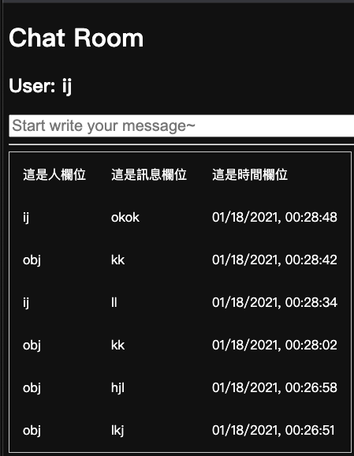

# 期末完整網站專案(Chatroom)

## 網址：
https://chatroom1123.herokuapp.com/

## 登入：

## 註冊：

### 資料會存入資料庫中

## 聊天室：

[Code](https://github.com/ChiaYunn/ws109a/blob/master/final/Server.py)

### 訊息發送後會依時間推送至下方

## 參考資料：

1.https://codertw.com/程式語言/3741

2.https://www.youtube.com/watch?v=ZvU57lTnNgo

3.https://ithelp.ithome.com.tw/articles/10213468

4.https://ithelp.ithome.com.tw/articles/10222132

5.https://www.w3schools.com/howto/howto_css_social_login.asp

6.https://pythonprogramming.net/server-chatroom-sockets-tutorial-python-3/

7.https://clay-atlas.com/blog/2019/10/15/python-chinese-tutorial-socket-tcp-ip/

8.https://blog.techbridge.cc/2017/06/03/python-web-flask101-tutorial-introduction-and-environment-setup/

9.https://pythonprogramming.net/client-chatroom-sockets-tutorial-python-3/?completed=/server-chatroom-sockets-tutorial-python-3/